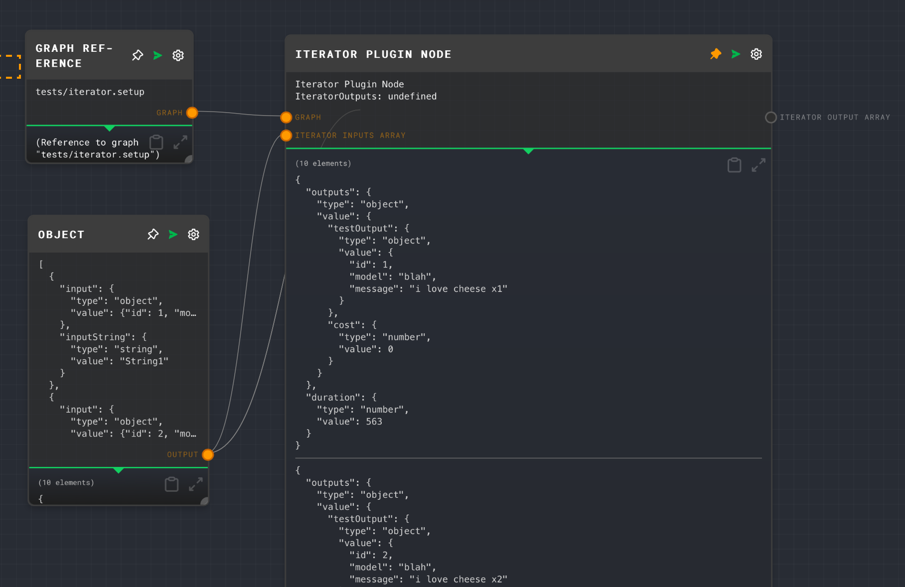

<h1 align="center"></h1>

## Description

This is an utilities plugin.

### Iterator Plugin

The iterator plugin will It will map through an array of object inputs `objectDataValues[][]`. The plugin will then call the subgraph you'd like to execute for item in the array.  Additionally 

- it has a `chunkSize` option to limit the number of concurrent executions.
- it has a `cache` option to cache subgraph outputs of successful item runs.  

# Installation

See [Rivet Plugins](https://rivet.ironcladapp.com/docs/user-guide/plugins) for more details

## Use

Once install you can use it as show in the examples below.  Make sure the inputs are DataValues.

### Inputs

Inputs must be an array of objects to iterate over.  Each object in the array should be a ObjectDataValue `{type: 'object', value: <graph inputs>}`; where `<graph inputs>` is of the format `{type: `object `, value: {<graph input id>: <input value>}}` The graph input id should match the graph's input ports.  The input value should be a DataValue.

### Outputs

Ouputs will be an array of ObjectDataValue `type: `object `, value: {<graph output id>: <output value>}`

## Source

This was forked from: This project is an example of a [Rivet](https://github.com/Ironclad/rivet) plugin. It is a minimal TypeScript Rivet plugin that adds a single node called Example Plugin Node.

> See [Rivet Example Plugin](https://github.com/Ironclad/rivet) on details on plugin architecture and building it

Use `pnpm` to build and install
